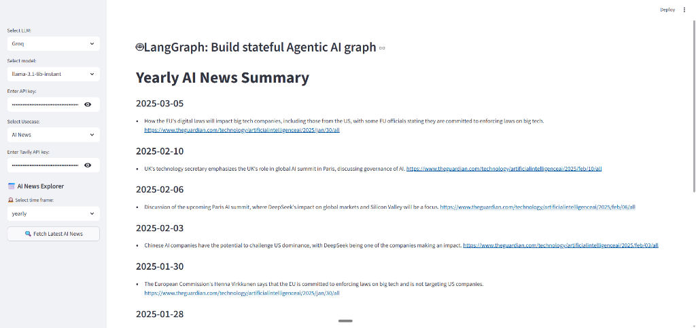

# 🤖 Agentic Chatbot - End-to-End Multi-Agent System


### 📝 Project Introduction
**Agentic Chatbot** is a sophisticated AI-driven application designed to demonstrate the power of autonomous agentic workflows. By leveraging **LangGraph** and **LangChain**, it orchestrates complex interactions between Large Language Models and external search tools to provide real-time information and structured news summaries. This project showcases state-managed AI reasoning, making it a robust template for developing production-ready, multi-node AI agents.

## 🖼️ Project Screenshot


## 🚀 Overview
**Agentic Chatbot** is a state-of-the-art AI application built with **LangGraph**, **LangChain**, and **Streamlit**. It demonstrates the power of agentic workflows by orchestrating complex tasks through a directed acyclic graph (DAG) architecture. Unlike linear chatbots, this system can reason, use tools, and loop back to optimize results, providing a truly "agentic" experience.

This project is designed to be a robust template for building production-grade AI agents that can handle web search, news aggregation, and advanced summarization with ease.

---

## ✨ Key Features

### 1. 🔍 Web-Enabled Chatbot (Agentic Search)
Leverages **Tavily Search** to provide real-time information from across the web. The agent can:
- Identify when it needs more information.
- Call search tools autonomously.
- Synthesize findings into a coherent response.
- Iterate if the search results are insufficient.

### 2. 📰 AI News Pipeline
A specialized automated pipeline that tracks the latest in Artificial Intelligence:
- **Fetch**: Uses Tavily API to scour the web for the latest AI breakthroughs.
- **Summarize**: Uses Groq-powered LLMs to condense news into readable markdown.
- **Persist**: Automatically saves daily, weekly, and monthly summaries for historical tracking.

### 3. 🧠 Smart Orchestration with LangGraph
The core logic resides in a state-managed graph:
- **Cycles**: Allows the agent to rethink and re-verify after tool usage.
- **Conditional Routing**: Decides dynamically whether to call a tool or respond directly.
- **State Management**: Maintains context across multiple nodes in the workflow.

---

## 🛠️ Technology Stack

| Category | Technology |
| :--- | :--- |
| **Orchestration** | [LangGraph](https://python.langchain.com/docs/langgraph) |
| **Framework** | [LangChain](https://python.langchain.com/) |
| **LLM Provider** | [Groq](https://groq.com/) (Llama 3, Mixtral, etc.) |
| **Search Engine** | [Tavily AI](https://tavily.com/) |
| **Frontend** | [Streamlit](https://streamlit.io/) |
| **Backend** | Python 3.x |

---

## 🏗️ Architecture

The project follows a modular node-based architecture:
- `src/langgraphagenticai/graph`: Built using `StateGraph` to define transitions and edges.
- `src/langgraphagenticai/nodes`: Contains discrete logic for chatbot reasoning, search execution, and summarization.
- `src/langgraphagenticai/tools`: Custom tool definitions (e.g., Tavily Search).
- `src/langgraphagenticai/ui`: A sleek Streamlit interface for seamless user interaction.

---

## 🚦 Getting Started

### Prerequisites
- Python 3.10+
- API Keys for **Groq** and **Tavily**

### Installation
1. **Clone the repository:**
   ```bash
   git clone https://github.com/[your-username]/Agentic-chatbot.git
   cd Agentic-chatbot
   ```

2. **Set up virtual environment:**
   ```bash
   python -m venv .venv
   source .venv/bin/activate  # On Windows: .venv\Scripts\activate
   ```

3. **Install dependencies:**
   ```bash
   pip install -r requirements.txt
   ```

4. **Environment Variables:**
   Create a `.env` file in the root directory:
   ```env
   GROQ_API_KEY=your_groq_key
   TAVILY_API_KEY=your_tavily_key
   ```

5. **Run the application:**
   ```bash
   streamlit run app.py
   ```

---

## 📈 Roadmap & Future Enhancements
- [ ] Add support for Multi-Agent Collaboration (Plan & Execute).
- [ ] Implement local RAG with Vector Databases (ChromaDB/FAISS).
- [ ] Expand toolset to include Image Generation and File Analysis.
- [ ] Add advanced evaluation metrics using LangSmith.

---

## 👨‍💻 Author
**Leela Karthik**
- [GitHub](https://github.com/LeelaKarthik-26)
- [LinkedIn](https://www.linkedin.com/in/leela-karthik/)

---
*If you like this project, feel free to ⭐ the repository!*
